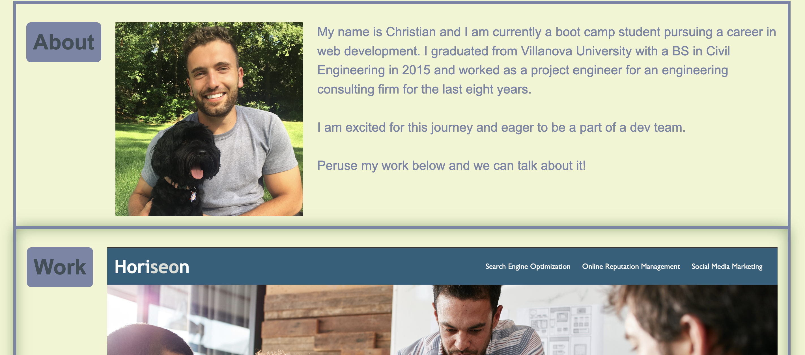
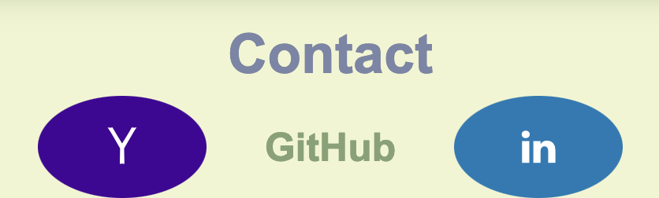

# CSS-Portfolio
[](code_of_conduct.md)

## The Repository

This repository was made from scratch to showcase my CSS skills and present my portfolio to other web developers, particularly potential employers.

---

## Installation

The code may be accessed on [GitHub](https://github.com/choelzli/CSS-Portfolio) or visiting the site URL (https://choelzli.github.io/CSS-Portfolio/).

Clone the repo:
```
git clone https://github.com/choelzli/CSS-Portfolio.git
```

---

## Usage

Upon accessing my portfolio webpage, it displays my name, a navigation bar, and a hero photo of my recent trip to Mount Rainier National Park.  


Clicking an item in the navigation bar directs the user to cards with additional information about myself and how to contact me.  



At the bottom of the page is a footer that buttons to either email me directly, access my GitHub page, or view my LinkedIn profile.


---

## License

Licensed under the MIT license.

---

## Credits

Base code strategies provided by Columbia Coding Bootcamp. Other sources include:
* [The Contributor Covenant](https://www.contributor-covenant.org/)
* [CSS Tricks - A Complete Guide to CSS Grid](https://css-tricks.com/snippets/css/complete-guide-grid/)
* [Khroma Color Generator](http://khroma.co/generator)
* [Professional README guide](https://coding-boot-camp.github.io/full-stack/github/professional-readme-guide)
* [README Template](https://github.com/othneildrew/Best-README-Template)
* [Stack Overflow: Avoid Stretch on Image CSS](https://stackoverflow.com/questions/16177707/avoid-stretch-on-image-css)
* [VS Code README](https://github.com/microsoft/vscode/tree/main)
* [W3 Schools: How to Social Media Buttons](https://www.w3schools.com/howto/howto_css_social_media_buttons.asp)
